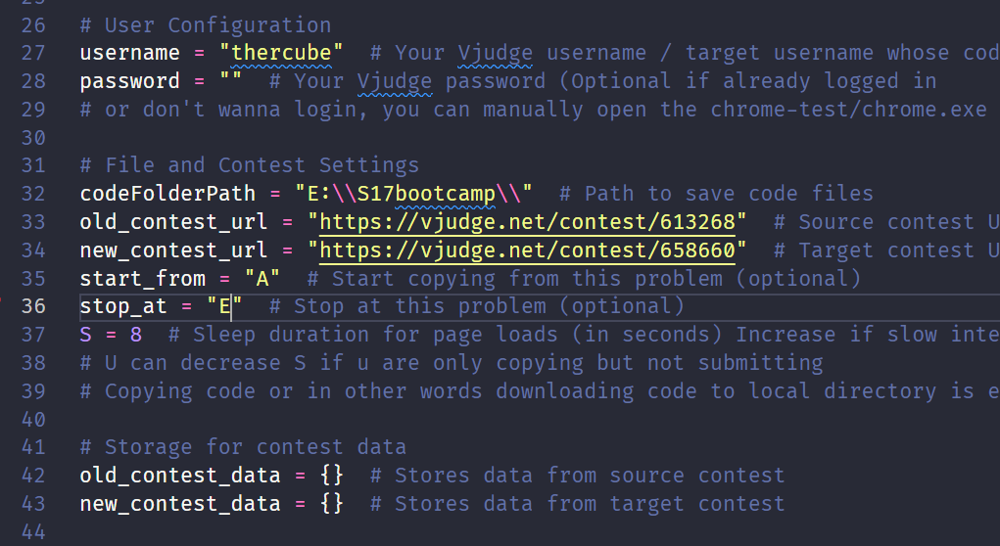

# Vjudge Contest Solution Transfer

This script automates the process of transferring solutions between Vjudge contests. It can copy solutions from one contest and submit them to another contest.

## Prerequisites

1. Python 3.x
2. Required Python packages (listed in requirements.txt):
   - selenium >= 4.0.0
   - webdriver-manager >= 3.8.0
3. Chrome for Testing and ChromeDriver (see Setup section)

## Setup

### 1. Browser Setup

1. Download Chrome for Testing:
   - Visit [Chrome for Testing Downloads](https://googlechromelabs.github.io/chrome-for-testing/)
   - Download the latest stable version for your OS
   - Extract the downloaded archive
   - Create a `chrome-win64` folder in the project directory
   - Move the extracted contents into `chrome-win64`

2. Download ChromeDriver:
   - From the same Chrome for Testing Downloads page
   - Download the ChromeDriver version matching your Chrome for Testing version
   - Extract the downloaded archive
   - Create a `chromedriver-win64` folder in the project directory
   - Move the extracted contents into `chromedriver-win64`

Your project structure should look like:
```
vjudge-transfer/
├── chrome-win64/
│   ├── chrome.exe
│   └── ...
├── chromedriver-win64/
│   ├── chromedriver.exe
│   └── ...
├── main.py
└── requirements.txt
```

### 2. Python Setup

1. Clone this repository:
   ```bash
   git clone https://github.com/yourusername/vjudge-transfer.git
   cd vjudge-transfer
   ```

2. Install dependencies:
   ```bash
   pip install -r requirements.txt
   ```

3. Configure settings in `main.py`:
   ```python
   username = "yourusername"  # Your Vjudge username
   codeFolderPath = "path/to/save/code/"  # Path to save code files
   old_contest_url = "https://vjudge.net/contest/OLDID"  # Source contest URL
   new_contest_url = "https://vjudge.net/contest/NEWID"  # Target contest URL
   start_from = "A"  # Start copying from this problem (optional)
   stop_at = "J"    # Stop at this problem (optional)
   S = 8  # Sleep duration for page loads (increase if internet is slow)
   ```

4. Login to Vjudge:
   ```bash
   chrome-win64/chrome.exe
   ```
   This opens Chrome for Testing browser. Log in to Vjudge here. The login data will be stored in `C:\Users\<your_pc_username>\AppData\Local\Google\Chrome for Testing\User Data` and will be used by the automation script.

## Available Functions

The script provides several functions that run in sequence:

1. `setup_driver()`: Initializes Chrome WebDriver with the proper configuration
2. `load_data()`: Loads or fetches contest data and caches it in JSON files
3. `copy_code()`: Copies solutions from the source contest and saves them in soldata.json
4. `save_as_cpp_file()`: Saves solutions as local .cpp files
5. `submit_code()`: (Optional) Submits solutions to the target contest

To use different functions, modify the main execution block in `main.py`:

```python
if __name__ == "__main__":
    try:
        if not setup_driver():
            print("Failed to initialize Chrome driver. Exiting...")
            exit(1)
        
        time.sleep(2)
        
        load_data()     # Always required first
        copy_code()     # Copy solutions from source contest
        save_as_cpp_file()  # Save solutions locally
        # submit_code() # Uncomment to submit solutions to target contest
    except Exception as e:
        print(f"An error occurred: {str(e)}")
    finally:
        try:
            driver.quit()
        except Exception as e:
            print(f"Error closing driver: {str(e)}")
```

## Demo and Screenshots

### User Configuration

*Screenshot showing the configuration settings in main.py*

### Demo Video
<video width="640" height="360" controls>
  <source src="https://github.com/rayedriasat/vjudge-transfer/raw/refs/heads/master/VJauto.mp4" type="video/mp4">
  Your browser does not support the video tag.
</video>
*Video demonstration showing the complete process of copying and submitting solutions*

## How It Works

1. **Setup**: The script uses Selenium WebDriver with Chrome to automate web interactions
2. **Data Storage**: 
   - Solutions are cached in `soldata.json`
   - New contest data is cached in `newdata.json`
3. **File Naming**: Solutions are saved as `{problem_id}_{sanitized_title}.cpp`

## Error Handling

- The script includes error handling for timeouts and missing solutions
- Progress is saved in JSON files to allow resuming interrupted transfers
- Failed operations are logged to console

## Limitations

1. Only supports C++ submissions by default (language preferences can be modified)
2. Requires matching problem titles between contests

## Tips

1. Increase the `S` variable if you're experiencing timeouts or CAPTCHA issues
2. Use `start_from` and `stop_at` to process specific problems
3. Solutions are saved locally before submission for backup
4. For a smoother experience, log in manually using Chrome for Testing before running the automation

## Development

- This project uses `.gitignore` to exclude user-specific files and configurations
- Cache files (`soldata.json`, `newdata.json`) are not tracked in git
- Chrome for Testing and ChromeDriver are not included in the repository due to size limitations
- Download and set up the browser components as described in the Setup section
